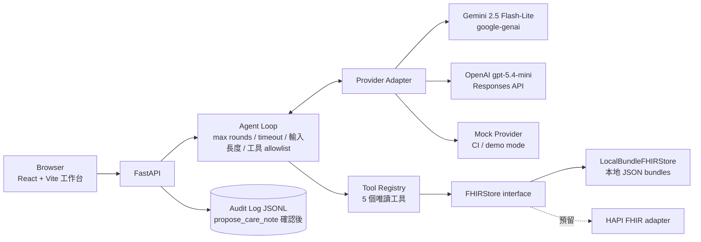

# FHIR Care Copilot — 實作計畫（權威版本）

> **狀態**：M0/M1/M2/M3 完成（2026-07-24），下一步 M4 API + 前端工作台
> **建立日期**：2026-07-19｜**外部事實查證日期**:2026-07-19（10 個研究/驗證 agents、51 個來源 URL 逐一 fetch 驗證）
> **使用方式**：每次實作 session 開始前，先讀本檔 + `docs/PROGRESS.md` 最末節。實作嚴格依 milestone 順序進行，完成一個勾一個。

---

## 1. 專案一句話

以 Synthea 公開合成病患 FHIR R4 資料為基礎的**長照個案查詢 copilot**：可追溯、工具受控、預設唯讀。LLM 不直接接觸資料庫、不憑記憶回答病患事實；每個病患事實都必須由 deterministic tool 回傳並附 FHIR `resourceType/id` 證據；資料不足時明確拒答。

## 2. 安全邊界（不可妥協）

- **不是醫療診斷工具**——UI 與所有文件明示；輸出僅為資料查詢彙整，不提供醫療建議
- **只用 Synthea 合成資料**——repo 與部署環境永不出現真實病患資料（PII/PHI 假設：一律視為不存在真實資料，但工程上仍以「彷彿是真資料」的紀律處理）
- **預設唯讀**——agent loop 的工具清單中不存在任何 write 類工具；唯一例外是 `propose_care_note`（僅產草稿 → UI 明確人工確認 → 寫入本地 audit log JSONL，**永不寫回 FHIR**）
- **可追溯**——每個回答附 `evidence[]`（resourceType/id）；引用無效或缺證據視為 eval 失敗
- **明確拒答**——查無資料、超出工具能力、或偵測到 prompt injection 時，回傳結構化拒答狀態
- **Prompt injection 邊界**——病患資料（FHIR 欄位內容）一律視為 data 而非指令；eval 內含 injection 題型驗證
- **Secret 永不進 git**——`.env` 已在 `.gitignore`；API key 只從環境變數注入

## 3. Milestones

> 每個 milestone 完成的定義：驗收標準達成 + 測試真實輸出記入 `docs/PROGRESS.md` + 勾選本節 checkbox。

- [x] **M0 — Phase 0 + 工程骨架**（2026-07-19 完成）
  本機 `git init`（不建 remote）；uv + `pyproject.toml`（Python 3.13，見 ADR 0002——原定 3.11 因 Windows 中文路徑 cp950 `.pth` 問題改版）；目錄 `src/ app/ tests/ scripts/ docs/ configs/`；`.gitignore`（`data/raw`、`data/processed`、`.env`、`reports/` 生成物另議）；README 骨架含 Synthea 來源/Apache-2.0/引用（見 §7）；`docs/decisions/0001-scope.md`（threat model、synthetic-only、read-only default、prompt injection 邊界、PII/PHI 假設、人工確認點）；ruff + mypy + pytest + pre-commit + GitHub Actions 骨架；justfile。
  **驗收**：`uv run pytest` 綠（至少 1 個 smoke test）；pre-commit 本機可跑；CI yaml 語法正確。
- [x] **M1 — 資料層**（2026-07-19 實作,2026-07-24 21-agent 審查修正完成）
  `scripts/download_or_generate_synthea.py`：預設下載官方 1K FHIR R4 樣本（URL 見 §7）+ `--subset N`（預設 100）子集化到 `data/processed`；偵測到 Java 17+ 時可 `-s <seed> -p 500` 本地生成。`FHIRStore` interface（Protocol）+ `LocalBundleFHIRStore`：病患索引、依 type/status/date 查資源、解析 `urn:uuid:` 參照、容忍 conditional search URL 參照、跳過 `hospitalInformation*.json` / `practitionerInformation*.json`。預留 HAPI FHIR base URL adapter 介面（只留 interface，不實作）。測試 fixture：committed 的 2–3 位手工裁剪合成病患（需涵蓋 `stopped` 與 `completed` 兩種藥物狀態、`medicationCodeableConcept` 與 `medicationReference` 兩種編碼）。
  **驗收**：store 單元測試綠；真實下載 1K 樣本、子集化 100 位並成功載入列出。
- [x] **M2 — 工具層（5 個唯讀工具）**（2026-07-19 實作,2026-07-24 16-agent 審查修正完成）
  `get_patient_demographics`、`list_active_conditions`、`list_active_medications`、`get_recent_observations`、`get_care_plan_timeline`。全部 Pydantic v2 嚴格 schema（輸入輸出皆是）；每個回傳值帶 `evidence[]`（resourceType/id）；查無資料回傳明確 insufficient 結構（不是空 list 混過去）。
  **驗收**：每工具獨立單元測試綠（含缺資料路徑）。
- [x] **M3 — Agent loop + providers**（2026-07-24 完成）
  回應契約（見 §5）；mock provider（deterministic、CI 不需金鑰）；agent loop 護欄：max tool rounds、timeout、輸入長度上限、工具 allowlist（write 類工具不存在於 loop）；Gemini adapter（`google-genai`、手動 function calling、`automatic_function_calling.disable=True`；model id 走 config，見下方「模型現況變化」）；OpenAI adapter（Responses API；模型 id 走 config 不寫死）；`propose_care_note` 草稿 + `confirm_and_log` 確認後寫本地 audit log JSONL（**刻意不進入**唯讀 agent loop 的工具清單，見 ADR 0001）；token 用量與成本計算（單價放 `configs/pricing.yaml`，不寫死在程式）；病患範圍由 loop 直接注入工具呼叫、LLM 無法透過參數竄改（見 ADR 0003）。
  **驗收**：mock provider 全流程測試綠（80 個測試）；Gemini 與 OpenAI 皆真跑並回報真實輸出（見下方「模型現況變化」與 PROGRESS.md）。
  ⚠️ **模型現況變化**（2026-07-24 實測發現）：`gemini-2.5-flash-lite`（§7 查證時的預設模型）對這把金鑰的帳號回傳 404「對新使用者已下架」，即使 `client.models.list()` 仍列得出來。改用同世代目前可用的 `gemini-3.1-flash-lite`（已用同一把金鑰實測成功），定價 $0.25 input / $1.50 output per 1M tokens（原模型 $0.10/$0.40 仍保留在 pricing.yaml 供之後換帳號時使用）。教訓：模型可用性會因 API 金鑰/帳號的新舊而異，不是只看官方文件列不列出來就準。
- [ ] **M4 — API + 前端工作台**
  FastAPI endpoints：病患清單、timeline、chat、care-note confirm、health/mode。React + Vite 工作台：病患選擇器、時間軸、對話區、證據抽屜、cost/latency badge、拒答狀態；**正體中文 UI（專有名詞保留原文）**、鍵盤可操作、手機可瀏覽；`vite build` 靜態檔由 FastAPI serve（單一 container）。
  **驗收**：一行指令本機啟動；90 秒 demo 路徑手動走通；基本 e2e smoke。
- [ ] **M5 — Eval harness**
  從 FHIR 結構自動產生 ≥200 筆有 deterministic 標準答案的 cases（不人工標註），題型：藥物、疾病、最近量測、時間順序、不可回答、prompt injection。指標：tool-selection accuracy、field exact match、citation validity、unsupported-claim rate、refusal accuracy、p50/p95 latency、平均成本。預算守門：預設 $5 上限、跑前估算、超過即停並提示。CI 以 mock provider 跑 eval。
  **驗收**：mock 全量 eval 跑通並輸出全部指標。
- [ ] **M6 — 模型比較**
  小樣本先跑（兩模型各 ~40 題）→ `--full-eval` 開關 + 成本預估。產出 `reports/eval_results.json`、圖表、`reports/model_comparison.md`。**任何模型品質結論必須由 eval 數字支持，不得宣稱未量測的準確率。**
  **驗收**：真實跑出的數字與成本紀錄。
- [ ] **M7 — 打包與發布準備**
  Multi-stage Dockerfile（front-end build → Python runtime；HF 要求 UID 1000）、docker-compose.yml；HF Docker Space 設定（README front-matter `sdk: docker` + `app_port`、Space Secrets、無金鑰自動切 mock/demo mode）；`MODEL_CARD.md`、`DATA_CARD.md`、`CITATION.cff`、`LICENSE`（**Apache-2.0**）；`scripts/publish_to_hf.py`（預設 dry-run，**不自動發布**）；README 完整版（90 秒 demo、Mermaid 架構圖、資料流、安全邊界、eval 表、成本、已知限制、面試說法、截圖 placeholder）。
  **驗收**：`docker compose up` 本機可用；publish script dry-run 通過。

## 4. 架構



資料流：使用者提問 → agent loop 規劃 tool calls → 工具查 FHIRStore → 帶 evidence 的結構化結果回 LLM → 組合回答（含 evidence/limitations/cost）→ UI 呈現 + 證據抽屜。LLM 從頭到尾看不到資料庫，只看到工具回傳的 schema 化結果。

### 目錄結構

```
src/fhir_copilot/
  store/        # FHIRStore protocol + LocalBundleFHIRStore（+ 預留 hapi.py interface）
  tools/        # 5 個唯讀工具 + propose_care_note（不進 agent loop allowlist）
  agent/        # loop、護欄、回應契約
  providers/    # base + gemini + openai + mock
  api/          # FastAPI app
app/            # React + Vite 前端
tests/          # pytest（fixtures 含手工裁剪合成 bundle）
scripts/        # download_or_generate_synthea.py、publish_to_hf.py、eval CLI
docs/           # PROGRESS.md、decisions/（ADR）
configs/        # 模型 id、單價、loop 護欄參數
reports/        # eval 產出（json / 圖表 / md）
data/raw、data/processed   # gitignored
```

## 5. 回應契約（每次回答固定輸出）

```json
{
  "answer": "……（正體中文，專有名詞保留原文）",
  "evidence": [{"resource_type": "Condition", "resource_id": "…", "field": "clinicalStatus", "value": "active"}],
  "limitations": "……（資料截止、缺漏欄位等）",
  "refused": false,
  "model": "gemini-2.5-flash-lite",
  "latency_ms": 1234,
  "input_tokens": 2048,
  "output_tokens": 256,
  "estimated_cost_usd": 0.00031
}
```

拒答時 `refused: true`、`answer` 為結構化拒答理由、`evidence` 為空。

## 6. Eval 計畫摘要

- Case 生成：直接讀 FHIR bundle 結構產生題目與標準答案（deterministic、不人工標註），每題記錄期望的 tool 序列與期望欄位值
- 題型配比（≥200 題）：藥物、疾病、最近量測、時間順序各 ~20%；不可回答 ~10%；prompt injection ~10%
- 指標：tool-selection accuracy、field exact match、citation validity（引用的 resourceType/id 真的存在且相關）、unsupported-claim rate、refusal accuracy、p50/p95 latency、平均成本
- 成本粗估（200 題 × ~2K in / 0.3K out per 題）：Gemini ≈ $0.06、gpt-5.4-mini ≈ $0.57 → 雙模型全量遠低於 $5 上限；預算守門仍必做（跑前估算、途中累計、超過即停）

## 7. 已查證外部事實（2026-07-19）

### Synthea
- 官方 repo：https://github.com/synthetichealth/synthea ，授權 **Apache-2.0**（GitHub API 確認）
- 引用：Walonoski J, et al. *Synthea: An approach, method, and software mechanism for generating synthetic patients and the synthetic electronic health care record.* JAMIA. 2018;25(3):230-238. https://doi.org/10.1093/jamia/ocx079
- ⚠️ **修正原始 spec**：官方沒有可確認的 100 位病患 R4 樣本包。已驗證可下載（HTTP 200、85,042,887 bytes）的是 ~1,000 位病患：
  `https://synthetichealth.github.io/synthea-sample-data/downloads/synthea_sample_data_fhir_r4_sep2019.zip`
  → 下載腳本抓 1K 樣本 + `--subset N`（預設 100）
- 本地生成：Java JDK 17+；`java -jar synthea-with-dependencies.jar -s <seed> -p 500 [state]`；相同 seed + 相同版本輸出一致；FHIR R4 為預設輸出（transaction bundle、`./output/fhir`）；會同時輸出 `hospitalInformation*.json`、`practitionerInformation*.json`
- `synthea.mitre.org` 會擋 bot（403/TLS），一律用上面 github.io 直連

### Synthea FHIR R4 bundle 結構（查自 FhirR4.java master 原始碼 + wiki，實作 M1/M2 的關鍵）
- 每位病患一個 JSON = 一個 `Bundle`，預設 `type: "transaction"`；第一個 entry 是 Patient，其餘大致依 Encounter 時序
- `Condition`：`clinicalStatus` = `active`/`resolved`；`onsetDateTime` 必有、`abatementDateTime` 結束才有；SNOMED CT
- `MedicationRequest`：進行中 `active`；**已結束的 status 有版本差異**——sep2019 樣本（pre-v3.4.0）用 `stopped`、v3.4.0+ 用 `completed` → parser 需接受 `active/stopped/completed`；編碼通常 `medicationCodeableConcept`（RxNorm），新版開 US Core IG 時可能是 `medicationReference` → **兩種都要處理**
- `Observation`：`status="final"`、LOINC、`effectiveDateTime`、`valueQuantity`（UCUM）；也可能 `valueCodeableConcept`、多 component（如血壓），或 **`valueString`**（social-history 類別常見，如居住/受虐狀況——對長照個案特別重要，M2 審查發現漏接會讓工具靜默回傳 `None`，跟「真的沒資料」無法區分）；真實 100 位病患樣本（19,550 筆）驗證只出現這 4 種 value[x] 形式
- `CarePlan`：`status` = `active`/`completed`；`period.start` 必有；活動在 `activity[].detail`；`addresses[]` 參照 Condition
- Bundle 內互相參照用 `urn:uuid:` fullUrl
- ⚠️ **修正**（M1 審查用真實下載的 1K 樣本重新查證，原始 spec 依二手文件寫的說法是錯的）：實測掃描全部 1,280 個 patient bundle、190 萬筆 reference 欄位，**0 筆是 conditional search URL**——Practitioner、Organization 都內嵌在病患 bundle 內、用 `urn:uuid` 就能正常解析（只有 Location 真的完全沒出現）。store 對含 `?` 的參照回傳 None 是**防禦性保留**（給其他版本/設定的 Synthea 輸出用），不是這份資料實際會走到的路徑。真正無法解析的參照是 **`#` 開頭的 contained resource 參照**（只出現在 `ExplanationOfBenefit`，如 `referral: "#referral"`，指向自己的 `contained[]`），1K 樣本裡有 93,736 筆——目前沒有工具讀 ExplanationOfBenefit，一律回傳 None
- `hospitalInformation*.json` / `practitionerInformation*.json` 是 `batch` type bundle → 載入時跳過
- ⚠️ **時間排序陷阱**：同一病患跨年份的 `effectiveDateTime`/`period.start` 會混用 `-04:00`/`-05:00` 位移（日光節約時間），**直接比字串排序會與實際時間相反**（M2 審查用真實資料證實）；一律要 parse 成 `datetime` 再比較，不能比字串
- ⚠️ **資料瑕疵**：真實樣本中 Left ventricular Ejection fraction 的 `category` code 誤植為單數 `vital-sign`（標準應為複數 `vital-signs`），19,550 筆中僅 5 筆；以 `category="vital-signs"` 篩選查不到——上游資料的極少數不一致，暫不處理，只記錄

### Gemini（google-genai SDK）
- 現行 SDK：`google-genai`（`from google import genai`）；舊 `google-generativeai` 已於 2025-11-30 棄用
- Key：`GEMINI_API_KEY` env var，`genai.Client()` 自動偵測（若同時設 `GOOGLE_API_KEY` 會優先，只設一個）
- 模型 id：`gemini-2.5-flash-lite`（GA/stable）；定價 $0.10 input / $0.40 output per 1M tokens；有 free tier
- 手動工具迴圈：`types.FunctionDeclaration(parameters_json_schema=…)` + `GenerateContentConfig(tools=[…], automatic_function_calling=AutomaticFunctionCallingConfig(disable=True))`；讀 `response.function_calls`；回傳 `Part.from_function_response`；結構化輸出 `response_mime_type='application/json'` + `response_schema=<Pydantic model>` → `response.parsed`；用量 `response.usage_metadata.prompt_token_count` / `.candidates_token_count`
- 注意：官方 docs 現在主推新 Interactions API surface；本專案**刻意選用** `client.models.generate_content`（穩定、文件齊全）→ 記入 ADR

### OpenAI
- ✅ `gpt-5.4-mini` 存在（snapshot `gpt-5.4-mini-2026-03-17`、400K context）；$0.75 input / $0.075 cached / $4.50 output per 1M tokens；tool calling 與 structured outputs 皆支援
- 新專案官方建議 **Responses API**；tool 定義扁平 `{"type":"function","name":…,"parameters":{…}}`；tool call 在 `response.output`（`type:"function_call"`，`arguments` 是 JSON 字串）；結果回傳 `{"type":"function_call_output","call_id":…,"output":…}`；用量 `response.usage.input_tokens` / `.output_tokens`；Key：`OPENAI_API_KEY`

### Hugging Face Docker Space
- README front-matter：`sdk: docker` + `app_port`（預設 7860）+ title/emoji/colorFrom/colorTo；文件：https://huggingface.co/docs/hub/spaces-config-reference
- Space Secrets 在 Settings 設定，**runtime 是普通 env var**；buildtime 拿不到（需 mount，本專案不需要）→「無金鑰自動切 mock/demo mode」設計成立
- 免費 cpu-basic：2 vCPU / 16GB RAM / 50GB 非持久碟；48h 不活動 sleep、訪客自動喚醒
- 程式化：`HfApi.create_repo(repo_id, repo_type='space', space_sdk='docker')` + `upload_folder(…)`；`add_space_secret()`；token 用 `HF_TOKEN`
- Dockerfile 需 UID 1000（`useradd -m -u 1000 user` + `USER user` + `COPY --chown=user`）；範例：https://huggingface.co/spaces/SpacesExamples/secret-example

## 8. 已確定的決策

| 決策 | 選擇 | 備註 |
|---|---|---|
| 文件語言 | 正體中文為主，專有名詞原文 | README/docs/報告一致 |
| UI 語言 | 正體中文為主 | 英文醫療資料並存呈現 |
| 前端 | React + Vite | build 靜態檔由 FastAPI serve |
| LICENSE | Apache-2.0 | 與 Synthea 資料授權一致 |
| W&B | 不整合 | eval 產物只出 reports/ |
| Gemini SDK surface | `client.models.generate_content` | 非新版 Interactions API，記 ADR |
| OpenAI SDK surface | Responses API | 官方建議 |
| 套件管理 | uv + pyproject.toml | Python 3.13（原定 3.11，因 cp950 `.pth` 問題改版，見 ADR 0002） |
| 任務指令 | justfile | Windows 相容性優於 Makefile |
| Git | 本機 git init（M0） | 不建 remote；之後由使用者自行整理上 GitHub |

## 9. 工作方式約定

- **每個 milestone 結束**：跑測試 → 真實輸出摘要記入 `docs/PROGRESS.md` → 勾本檔 §3 checkbox
- **專案 skills**（`.claude/skills/`）隨實作固化：`dev-loop`（啟動/測試指令）於 M0–M1、`synthea-data` 於 M1、`run-eval`（含預算守則）於 M5；流程穩定一個就固化一個
- **重大決策**寫 `docs/decisions/NNNN-*.md`（ADR）
- **每次 session 開始**：先讀本檔 §3 現況 + `docs/PROGRESS.md` 最末節
- **不宣稱未量測的數字**；測試失敗照實記錄

## 10. 已知風險

| 風險 | 影響 | 對策 |
|---|---|---|
| 專案路徑含中文與空格 | uv/node/docker 可能踩雷 | **M0 已實測**：Python 3.11/3.12 的 `.pth` cp950 問題 → 改用 3.13 解決（ADR 0002）；pre-commit 設定檔需 ASCII-only；node（M4）與 docker（M7）屆時再實測 |
| 模型 id / 定價漂移 | 成本估算失準、呼叫失敗 | 全放 `configs/`，不寫死 |
| Gemini free tier quota | eval 中斷 | 有 3 組 backup key；選配 429 failover（非核心） |
| sep2019 樣本較舊（pre-v3.4.0） | 欄位慣例與新版不同 | parser 同時支援新舊慣例；fixture 兩種都涵蓋 |
| HF Space 免費層 sleep | demo 第一次開很慢 | README 註明；demo mode 輕量化 |
