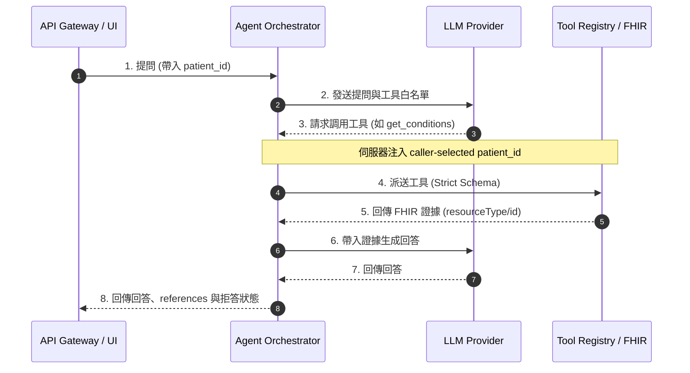

# FHIR Care Copilot

[](https://github.com/kuotunyu/fhir-care-copilot/actions/workflows/ci.yml)
[](https://github.com/kuotunyu/fhir-care-copilot/releases/latest)


FHIR Care Copilot 是以 Synthea 合成 FHIR R4 紀錄為資料來源的安全型 AI application 工程展示。它聚焦 tool-controlled retrieval、server-injected patient scope、可核對 references 與 failure paths；不含真實病患資訊，也不是 production healthcare deployment。

> **免責聲明**：本系統僅為醫療資訊互通性 (FHIR Interoperability)、LLM Orchestration 與安全邊界之工程展示，不可用於實際臨床診斷或醫療行為。

**快速審閱：** [75 秒 Demo](https://github.com/kuotunyu/fhir-care-copilot/releases/download/v0.2.0/FHIR_Care_Copilot_Demo_v0.2.0.mp4) · [Case Study](docs/CASE_STUDY.md)

公開 demo 固定使用 `mock` provider 與 Synthea 合成資料，不呼叫付費模型 API。

---

## 核心技術特性

1. **Server-Injected Patient Scope**：
   每次 API request 的 `patient_id` 由後端保留並在 Tool Dispatch 注入；模型看不到 patient 參數，也無法覆寫 caller 選定的 scope。這不限制 caller 能選哪位病患，因此不構成 patient-level authorization。
2. **可稽核之唯讀 FHIR 檢索 Tool Registry**：
   Agent 僅能呼叫 deterministic 唯讀工具。成功取得資料時，tool 結果附 FHIR `resourceType/id` references 供 Evidence Drawer 核對；拒答或合法空結果可能沒有 evidence。
3. **Deterministic Mock 模式**：
   預設 Mock Provider 不需 API key、不呼叫付費 LLM、可在 CPU 執行。相同 commit、config 與 synthetic fixtures 下走固定規則；它驗證工程路徑，不代表真實模型品質。
4. **PII-safe Observability 與 tamper-evident Audit**：
   應用層 log/trace 不記錄姓名或自由文字，patient ID 以 keyed HMAC pseudonym 表示；audit 使用 append-only signed hash chain 偵測竄改，但不是不可變儲存，retention 仍由部署者管理。

---

## 系統架構與請求時序

### 請求處理與資安隔離時序



---

## 安全邊界機制

| 安全機制維度 | 實作行為與硬性限制說明 |
|---|---|
| **Patient Scope 隔離** | 呼叫端於每筆 API 獨立代入 `patient_id`，後端強制覆寫模型可能產生的參數。這是 model-control boundary，不是 caller authorization。 |
| **唯讀 Tool 限制** | 白名單僅開放 Deterministic 唯讀檢索工具，完全無 FHIR 寫入權限，並透過 Pydantic Strict Schema 阻擋未預期參數。 |
| **證據鏈語意 (Evidence)** | 成功檢索時，工具回應包含 FHIR `resourceType/id` 引用，用來驗證該 Resource 存在於本次 Synthea store。拒答或合法空結果可能沒有 evidence。 |
| **隱私與日誌安全** | Log 與 Trace 排除姓名與自由文字，對 patient ID 做 pseudonymization；signed hash chain 提供 tamper-evident audit integrity，並非 immutable storage。 |

病患資料檢索只會經由 allowlisted deterministic tools；tool 結果包含 FHIR `resourceType/id` references。
`reference existence` 不代表自然語言答案逐句 grounded；`reference integrity` 僅驗證該引用存在於本次使用的 Synthea store，不代表逐句正確、完整或具醫療效力。

### 失敗處理邊界

無效 API key 以 401 fail closed；audit backend 不可用時 health 會降級並以 503 阻擋 chat；provider 持續失敗時回傳結構化拒答。

---

## 快速開始

專案預設啟動 deterministic `mock` 模式，無須設定 API key，即可體驗主要唯讀查詢、Evidence Drawer 與結構化拒答路徑。

### 使用 Docker Compose 啟動

```bash
# 複製並啟動容器 (伺服器將執行於 localhost:8000)
docker compose up --build
```

### 本地開發環境啟動

需求：Python 3.13、`uv`、`just`、Node.js。

```bash
# 下載/產生 100 位 Synthea 合成病患數據
uv run python scripts/download_or_generate_synthea.py --subset 100

# 啟動前後端服務 (開啟 localhost:8000)
just run
```
