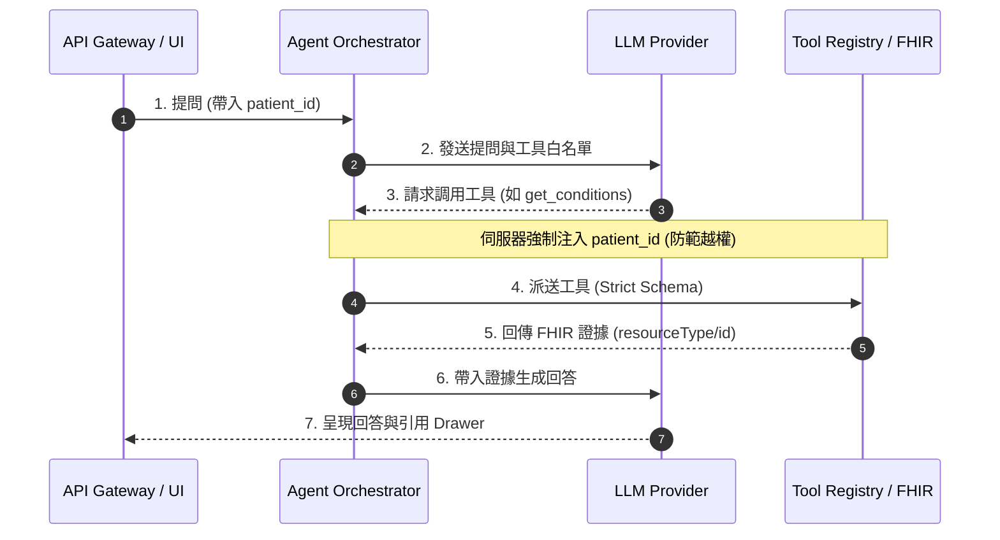

# FHIR Care Copilot

[](https://github.com/kuotunyu/fhir-care-copilot/actions/workflows/ci.yml)
[](https://github.com/kuotunyu/fhir-care-copilot/releases/latest)


本專案為強調資安隔離與可驗證性的醫療 AI Agent 系統，針對長照情境下的 FHIR R4 醫療紀錄進行問答與臨床文檔檢索。全專案僅採用 Synthea 合成醫療資料 (Synthetic Data)，不含任何真實病患資訊。

> **免責聲明**：本系統僅為醫療資訊互通性 (FHIR Interoperability)、LLM Orchestration 與安全邊界之工程展示，不可用於實際臨床診斷或醫療行為。

---

## 核心技術特性

1. **伺服器端病患權限強制注入 (Server-Injected Patient Scope)**：
   每次 API 請求之 `patient_id` 由後端伺服器單獨注入 Tool Dispatch 層級，確保 LLM 模型無法自行覆寫或跨病患讀取資料。
2. **可稽核之唯讀 FHIR 檢索 Tool Registry**：
   Agent 僅能呼叫 Deterministic 的唯讀檢索工具，每次回應均附帶可驗證之 FHIR `resourceType/id` 證據鏈 (Evidence Drawer)。
3. **無損與極速之 Deterministic Mock 模式**：
   預設提供無 API Key 依賴之 Mock Provider，完全不需消耗付費 LLM API 費用，兼具 CPU 效能安全性與 100% 可重現性。
4. **PII 隱私防護與不可竄改 Audit Log**：
   日誌與追蹤資料排除任何病患姓名與自由格式文字，並透過簽名雜湊鏈 (Append-only Hash Chain) 進行稽核防竄改。

---

## 系統架構與請求時序

### 請求處理與資安隔離時序



---

## 安全邊界機制

| 安全機制維度 | 實作行為與硬性限制說明 |
|---|---|
| **Patient Scope 隔離** | 呼叫端於每筆 API 獨立代入 `patient_id`，後端強制覆寫模型可能產生的參數，防止 LLM 越權檢索其他病患資料。 |
| **唯讀 Tool 限制** | 白名單僅開放 Deterministic 唯讀檢索工具，完全無 FHIR 寫入權限，並透過 Pydantic Strict Schema 阻擋未預期參數。 |
| **證據鏈語意 (Evidence)** | 工具回應包含 FHIR `resourceType/id` 引用，驗證該 Resource 於 Synthea 數據庫之真實存在性。 |
| **隱私與日誌安全** | Log 與 Trace 剔除姓名與自由文字，對病患 ID 進行偽匿名化 (Pseudonymization)，並透過簽名雜湊鏈維護 Audit Integrity。 |

---

## 快速開始

專案預設自動啟動 Deterministic `mock` 模式，無須設定任何 API Key 即可完整體驗系統功能。

### 使用 Docker Compose 啟動

```bash
# 複製並啟動容器 (伺服器將執行於 localhost:8000)
docker compose up --build
```

### 本地開發環境啟動

需求：Python 3.13、`uv`、`just`、Node.js。

```bash
# 下載/產生 100 位 Synthea 合成病患數據
uv run python scripts/download_or_generate_synthea.py --subset 100

# 啟動前後端服務 (開啟 localhost:8000)
just run
```
