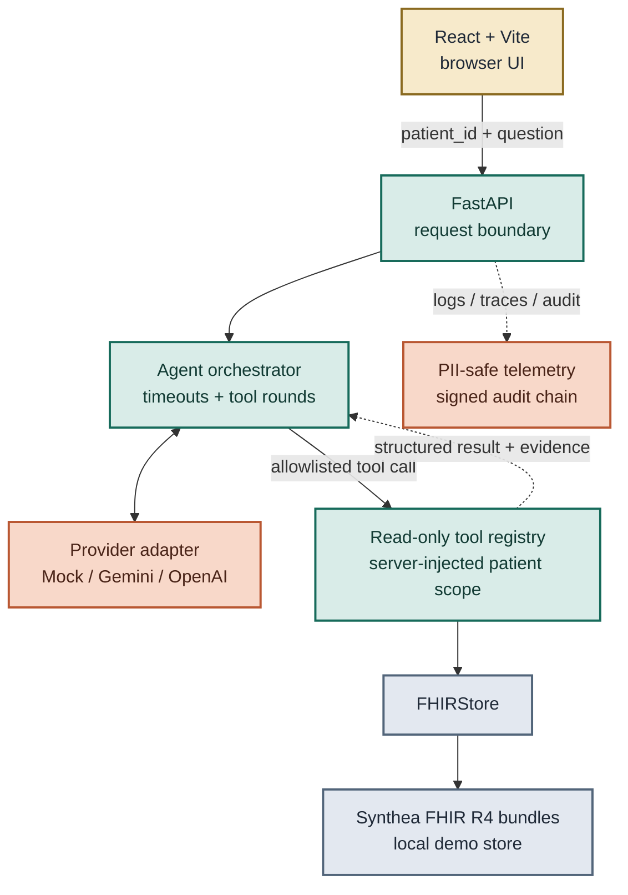

# FHIR Care Copilot

[](https://github.com/kuotunyu/fhir-care-copilot/actions/workflows/ci.yml)
[](https://github.com/kuotunyu/fhir-care-copilot/releases/latest)

Security-focused FHIR AI application for reviewing a synthetic long-term-care record through
a tool-controlled assistant. It uses Synthea 合成資料 only: no real patient data is included.

> **This is not a medical diagnosis or clinical-use product.** It demonstrates healthcare
> interoperability, LLM orchestration, security boundaries, and reproducible engineering evidence.

**Review paths:** [Live demo](https://huggingface.co/spaces/steven0226/fhir-care-copilot) ·
[75-second demo video](https://github.com/kuotunyu/fhir-care-copilot/releases/download/v0.2.0/FHIR_Care_Copilot_Demo_v0.2.0.mp4) ·
[Case study](docs/CASE_STUDY.md)

公開 demo 固定使用 `mock` provider 與 Synthea 合成資料；it is deterministic, CPU-safe,
and makes no paid model API calls. The Release badge is the entry point to the latest release.

## What this demonstrates

- Server-injected patient scope: each request keeps `patient_id` outside model-facing tool
  arguments, so the model cannot select or override the patient.
- Read-only FHIR tools return verifiable `resourceType/id` evidence for the resources they use.
- PII-safe telemetry, signed audit history, deterministic mock mode, and CPU-safe reproducibility
  keep the engineering path inspectable without real medical data.


The workbench lets a reviewer choose a synthetic patient, inspect the FHIR timeline, ask a
question, and open the evidence drawer. The visible references are designed for verification,
not as a claim that every sentence produced by a provider is clinically correct.

## Architecture



病患資料檢索只會經由 allowlisted deterministic tools；tool 結果包含 FHIR `resourceType/id` references。
`reference existence` 不代表自然語言答案逐句 grounded；
reference integrity only verifies that a returned reference exists in the Synthea store used
for that run. The model has no direct FHIR-store access, and HAPI FHIR is only an optional
adapter stub, not an implemented integration.

## Security boundaries

| Boundary | Implemented behavior and explicit limit |
|---|---|
| Patient scope | The caller supplies `patient_id` separately on each API request. The server injects it only at tool dispatch and overwrites conflicting model output. This constrains the model, not which patient a caller may choose. |
| Read-only tools | The allowlist contains deterministic retrieval tools and one structured out-of-scope declaration; it exposes no FHIR write path. Strict schemas reject unexpected arguments. |
| Evidence semantics | Tool results carry `evidence[]` with FHIR `resourceType/id` references. Reference integrity checks existence, not sentence-level grounding, factual completeness, medical validity, or provider quality. |
| Authentication / authorization | Optional API key authentication can protect routes. It is not user-to-patient authorization, RBAC, tenant isolation, or SMART-on-FHIR. |
| Privacy / observability | Logs and traces omit names and raw free text, pseudonymize patient IDs, and expose request shape instead of content. Signed drafts plus an append-only hash chain make audit-history tampering detectable; retention remains an operator responsibility. |

The same boundary separation matters during failure handling: authentication controls who may
call an endpoint, server injection constrains what patient scope reaches tools, and evidence
semantics constrain what a returned reference proves. None substitutes for the others.

## Evidence and limits

- Backend evidence is exercised by the committed pytest suite across tool schemas, patient-scope
  injection, authentication, rate limits, budgets, resilience, PII redaction, and audit integrity.
- Frontend evidence includes 35 Vitest tests for API behavior, status disclosure, and chat errors;
  it is targeted component evidence rather than full visual or end-to-end UI coverage.
- Provider artifacts preserve three historical 220-case paid-provider runs, transcripts, metric
  provenance, and known evaluator limits; they were not rerun or relabeled for this README.
- Docker evidence includes image build, built-in `/api/health`, container health, and smoke checks
  in CI using synthetic data and mock mode.
- GitHub CI covers backend checks on Ubuntu and Windows, frontend lint/test/build, Postgres audit
  integration, and container smoke; CodeQL and Dependabot remain repository security gates.

These are engineering and reproducibility signals. They do not establish clinical efficacy,
clinical safety, regulatory compliance, production readiness, or fitness for patient care.

Failure behavior is explicit: an invalid API key fails closed, unavailable audit storage degrades
health and blocks chat, and provider failures return a structured refusal.

For the detailed evaluation record, data provenance, and persistence/threat boundaries, see the
[Model card](MODEL_CARD.md), [Data card](DATA_CARD.md), and [Security policy](SECURITY.md).

## Quick start

Use the mock path for portfolio review. Provider adapters are optional and are not required to
exercise the request, tool, evidence, refusal, or audit flow.

The default local path needs Python 3.13, `uv`, `just`, and Node.js for the frontend build.
Download or generate the existing 100-patient Synthea subset, then start the application:

```bash
uv run python scripts/download_or_generate_synthea.py --subset 100
just run
```

Open `localhost:8000`, choose a synthetic patient, ask a question, and expand the evidence drawer
to inspect the returned FHIR references. No provider API key is required: when neither provider
API key is configured, the application automatically falls back to the deterministic `mock`
provider and makes no external model call.

Docker is the minimal alternative and serves the same workbench on `localhost:8000`:

```bash
docker compose up --build
```

Both paths are for synthetic demonstration and local engineering review. Do not substitute real
medical records or treat the generated response as diagnosis, treatment, or clinical guidance.

## Technology and license

Python 3.13 · FastAPI · Pydantic v2 · React 19 · Vite 8 · TypeScript 6 · FHIR R4 ·
OpenTelemetry · Prometheus · optional Postgres audit storage · Docker · GitHub Actions.

Demo records are generated by Synthea (MITRE) and contain synthetic patients only. The source code
is released under [Apache-2.0](LICENSE).
