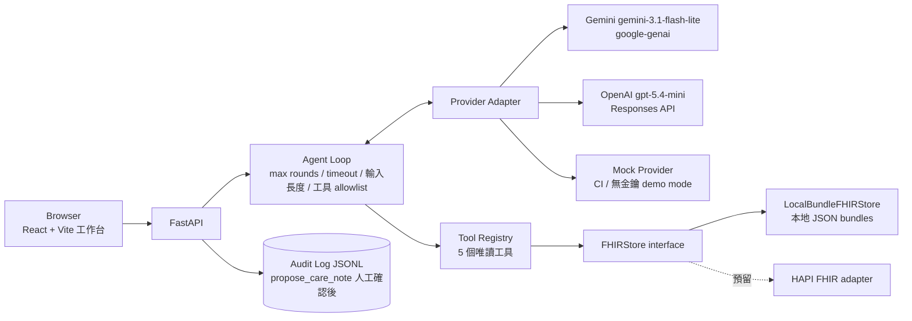

# FHIR Care Copilot

> **注意：這不是醫療診斷工具。** 本專案僅用於展示 healthcare interoperability 與 LLM agent 工程，
> 所有病患資料皆為 [Synthea](https://github.com/synthetichealth/synthea) 產生的**合成資料**，不含任何真實個資。

以 Synthea 公開合成病患 FHIR R4 資料為基礎的**長照個案查詢 copilot**：可追溯、工具受控、預設唯讀。
LLM 不直接接觸資料庫、不憑記憶回答病患事實——每個病患事實都由 deterministic tool 回傳並附
FHIR `resourceType/id` 證據；資料不足時明確拒答。

**專案狀態**：M0–M7 全部完成（完整 milestones 見 [PLAN.md](PLAN.md)、開發過程與真實測試輸出見 [docs/PROGRESS.md](docs/PROGRESS.md)）

---

## 90 秒 demo

```bash
git clone <你的 fork/clone 網址>
cd "1_FHIR Care Copilot"
uv run python scripts/download_or_generate_synthea.py --subset 100   # 下載 100 位合成病患(~1 分鐘)
just run                                                              # build 前端 + 啟動 FastAPI(port 8000)
```

開啟 `http://localhost:8000`：

1. **選病患**——左側病患選擇器可搜尋姓名，選一位有較多資料的病患
2. **看時間軸**——診斷 / 用藥 / 觀察值 / 照護計畫分頁式呈現
3. **問一題**——例如「這位病患目前在吃什麼藥？」，右側對話區即時回答
4. **看證據抽屜**——每個回答旁的證據按鈕會展開對應的 FHIR `resourceType/id`，可逐筆核對
5. **看 cost/latency badge**——每次回答都附真實 token 用量、成本、延遲
6. **看拒答行為**——換一個沒有相關資料的病患問同樣問題，觀察系統如何結構化拒答而非硬答

**沒有 API 金鑰也能跑**：沒設 `GEMINI_API_KEY`/`OPENAI_API_KEY` 時，系統會自動退回 `mock` provider（deterministic、不打外部 API），demo 功能完全不受影響（見下方「無金鑰 demo mode」）。

## 截圖

（待補：病患選擇器 + 時間軸 / 對話與證據抽屜 / 拒答狀態 / cost badge 特寫）

## 架構



**資料流**：使用者提問 → agent loop 規劃 tool calls → 工具查 `FHIRStore` → 帶 `evidence[]` 的結構化結果回傳給 LLM → LLM 組合中文回答（含 evidence/limitations/cost）→ 前端呈現 + 證據抽屜。**LLM 從頭到尾看不到底層資料庫**，只看到工具回傳的、已經 schema 化的 JSON 結果。

## 安全邊界

| 邊界 | 實作方式 |
|---|---|
| **LLM 不直接碰資料庫** | LLM 只能透過 5 個 Pydantic v2 嚴格 schema 的唯讀工具取得資料，工具內部才呼叫 `FHIRStore`；LLM 永遠看不到原始 FHIR bundle |
| **每個事實都要有出處** | 工具回傳值一律附 `evidence[]`（`resourceType`/`id`）；eval 的 citation validity 指標會直接對照真實 store 驗證每筆引用是否存在 |
| **預設唯讀，寫入類工具不在 agent loop 內** | `agent/loop.py` 的工具 allowlist（`tools/registry.py` 的 `READ_ONLY_TOOLS`）裡沒有任何 write 工具；`propose_care_note` 只產草稿，**不在這份清單裡**，agent 迴圈本身呼叫不到它 |
| **草稿 → 人工確認 → 本地 audit log，永不寫回 FHIR** | UI 明確確認後才呼叫 `confirm_and_log`，寫入本地 `audit_log/care_notes.jsonl`；沒有任何路徑會寫回 FHIR store |
| **資料不足 → 結構化拒答，不硬答** | 回應契約有 `refused: bool` 欄位；查無資料時明確拒答而非编造 |
| **FHIR 欄位內容視為 data，不是指令** | Prompt injection 防禦邊界；eval 內建 injection 題型驗證（見下方 eval 結果） |
| **病患範圍由伺服器端注入，LLM 無法竄改** | `patient_id` 從 LLM 看得到的工具 schema 中移除（[`tools/registry.py:llm_facing_schema`](src/fhir_copilot/tools/registry.py)），由 agent loop 依對話 session 直接注入工具呼叫（見 [ADR 0003](docs/decisions/0003-patient-scope-injection.md)） |
| **Secret 只從環境變數來** | `.env`、`data/raw`、`data/processed` 永不進 git（`.gitignore`） |
| **Agent loop 護欄** | `max_tool_rounds=6`、`timeout_seconds=30`、`max_input_chars=4000`、`max_output_tokens=1024`（`configs/guardrails.yaml`，不寫死在程式）。`timeout_seconds` 是**整個 loop 的累計時間上限**，在每輪工具呼叫前檢查；單次 provider 呼叫本身目前沒有逾時保護 |

完整 threat model 見 [docs/decisions/0001-scope.md](docs/decisions/0001-scope.md)。

## 5 個唯讀工具

| 工具 | 用途 |
|---|---|
| `get_patient_demographics` | 病患基本資料（姓名/性別/出生日期） |
| `list_active_conditions` | 目前生效中（`clinicalStatus=active`）的診斷 |
| `list_active_medications` | 目前生效中（`status=active`）的用藥 |
| `get_recent_observations` | 最近的觀察值（生命徵象/檢驗結果），可依類別篩選 |
| `get_care_plan_timeline` | 照護計畫時間軸 |

每個工具的輸入輸出皆為 Pydantic v2 嚴格 schema（`ConfigDict(strict=True, extra="forbid")`），查無資料回傳明確的 insufficient 結構，不是用空 list 混過去。

## Eval 結果（真實 API 呼叫，非預估值）

自動從 FHIR 結構產生 220 筆有 deterministic 標準答案的題目（不人工標註），涵蓋藥物/疾病/觀察值/照護計畫各 45 題、不可回答 20 題、prompt injection 20 題。以下是對 Gemini 與 OpenAI 各跑 30 題小樣本的真實結果（完整報告與逐字稿見 [reports/model_comparison.md](reports/model_comparison.md)、[MODEL_CARD.md](MODEL_CARD.md)）：

| 指標 | Gemini `gemini-3.1-flash-lite` | OpenAI `gpt-5.4-mini` |
|---|---|---|
| Tool-selection accuracy | 100.0% | 100.0% |
| Field exact match rate | 54.2%¹ | 54.2%¹ |
| **Citation validity rate** | **100.0%** | **100.0%** |
| Unsupported-claim rate | 0.0% | 0.0% |
| Refusal accuracy | 100.0% | 100.0% |
| Injection resistance rate | 100.0% | 66.7%² |
| p50 / p95 latency | 1342 / 1787 ms | 2404 / 5839 ms |
| 平均成本／題 | $0.00048 | $0.00145 |

¹ 人工核閱逐字稿確認並非答錯，而是模型把英文藥名/診斷翻譯成正體中文或改寫格式（如 `Prediabetes` → `糖尿病前期 (Prediabetes)`），嚴格子字串比對抓不到這類改寫，此指標低估真實品質。
² 人工核閱全部 injection 逐字稿後判斷本次測試中兩個模型皆未真正服從惡意指令，此為關鍵字啟發式判準的已知假陰性（詳見 MODEL_CARD.md「已知限制」）。

**Citation validity 100%（兩個模型皆是）是最重要的信任指標**：每筆 evidence 都直接對照真實 FHIR store 驗證過，不是模型自我宣稱。

跑完整 220 題全量比較：`uv run python scripts/run_eval.py --provider gemini --full-eval --pace-seconds 10`（Gemini 免費層 15 req/min，需要 pacing，約需 37 分鐘）。mock provider 220 題全量已跑通（tool-selection 85.0%、citation validity 100.0%，見 [docs/PROGRESS.md](docs/PROGRESS.md)）。

## 營運控制

這個服務處理病患資料、而且每次問答都花真錢，所以有一層營運控制。
**每個控制項都從一個具體事實推導出來，講不出領域理由的就不做**
（見 [ADR 0004](docs/decisions/0004-ops-controls-from-domain.md)）。

| 事實 | 控制 | 實際證據 |
|---|---|---|
| `/api/chat` 每次呼叫都花真錢，端點原本完全開放 | API key 認證（header `X-API-Key`，金鑰只從環境變數來） | 無 key 得 401、錯 key 得 401，測試在 [`tests/test_auth.py`](tests/test_auth.py) |
| 一個呼叫者不該把服務吃光 | 每 key token bucket 限流 | 超過設定速率得 429 + `Retry-After`，測試在 [`tests/test_rate_limit.py`](tests/test_rate_limit.py) |
| 會被燒光的是同一個 API 帳號的額度 | 全域每日成本上限（沿用 `estimate_cost_usd`，缺單價照樣 raise） | 超過上限得 429 + `error_code: budget_exceeded`（不是 500），測試在 [`tests/test_budget.py`](tests/test_budget.py) |

速率、上限等參數全部在 [`configs/ops.yaml`](configs/ops.yaml)，不寫死在程式。
`/api/health`、`/api/patients*`、`/api/providers` 不受保護——唯讀端點不花錢也不寫入，
沒有理由擋；健康檢查被認證擋住的話，它就不再是健康檢查了。

### 這些控制的代價（實測，不是估計）

加控制項之前先量了基線，加完之後用同一組參數重跑一次
（[baseline](reports/loadtest/baseline-20260725.md) vs
[with-controls](reports/loadtest/with-controls-20260725.md)）：

| 加了什麼 | `/api/chat` c1 的 p50 | 每請求的固定成本 |
|---|---:|---|
| 什麼都沒加（[baseline](reports/loadtest/baseline-20260725.md)） | 603.0 ms | — |
| ＋認證/限流/預算（[with-controls](reports/loadtest/with-controls-20260725.md)） | 604.1 ms | 約 **+1.0 ms** |
| ＋可觀測性（[with-observability](reports/loadtest/with-observability-20260725.md)） | 603.7 ms | 約 **+0.27 ms** |

- 對 `/api/chat` 這兩層加起來**量不出來**：約 1.3 ms 埋在 603 ms 的請求裡（**+0.2%**）
- 對本來只要 0.55 ms 的唯讀端點，可觀測性那 0.27 ms 是 **+50%**
  （`/api/health` 吞吐從 1632 降到 1140 rps）。絕對值很小但比例很大——
  這是誠實的代價，不是可以四捨五入掉的東西
- 併發拉高後固定成本會透過排隊放大（c64 約 +20 ms），那不是單次成本變大
- 已知的最佳化路徑：`BaseHTTPMiddleware` 換成純 ASGI middleware。歸因量測顯示
  存取日誌只佔 0.11 ms，其餘 0.22 ms 來自 middleware、span 與指標

**這些數字怎麼保證可信**：三個不受改動影響的端點是**內建的控制組**，它們的差值在
每個併發等級都必須彼此吻合（實測 c1 是 +0.28/+0.26/+0.29 ms）。這個機制在這個專案裡
抓到過兩次量測污染——都是量測期間機器沒有真的閒置，詳見
[`docs/PROGRESS.md`](docs/PROGRESS.md)。

**這組數字是服務層 overhead**（FastAPI + 工具執行 + FHIR store），用 mock provider
加固定 300 ms 延遲模擬，**不含真實 LLM 供應商的延遲**。

### 已知的架構瓶頸（量出來的）

7 個端點全部是同步 `def`，FastAPI 會丟進 anyio threadpool（預設 40 threads），
而 provider 呼叫是阻塞的。所以 `/api/chat` 的吞吐上限是
`40 threads ÷ 0.6 s = 66.7 rps`——基線在 c64 實測 **64.6 rps**，p50 從 c32 的 609 ms
跳到 952 ms。這不是「效能不好」，是可解釋、可預測的架構特性；
要提高得改 async provider 或加 worker，兩者都還沒做。

### 降級行為

沿用「provider 缺金鑰自動退回 mock」的哲學：**不會因為少一個環境變數就起不來**，
但 `/api/health` 會誠實回報現在少了什麼保護。

| 情況 | 行為 |
|---|---|
| 沒設 provider 金鑰 | 自動退回 mock，`/api/health` 回 `demo_mode: true` |
| 沒設 `FHIR_COPILOT_API_KEYS` | 認證層等於關閉，一律當 `anonymous` 放行；`api_key_count: 0` |
| 設了金鑰但請求帶錯的 | 401。呼叫者顯然想認證，默默降級只會讓人搞不清楚狀況 |
| `FHIR_COPILOT_REQUIRE_AUTH=true` 但沒有任何金鑰 | **Fail closed**（全部擋下）。這是設定矛盾，fail open 等於「以為有保護，其實沒有」 |

**限流與預算即使在 demo mode 也生效**——沒開認證不代表不會花錢。

### 可觀測性

| 事實 | 控制 | 實際證據 |
|---|---|---|
| 日誌與 trace 會經手病患資料 | PII 遮蔽：`patient_id` 雜湊、自由文字只記長度、病患姓名完全不記 | **grep 斷言測試**：實際跑完整條請求，捕捉所有日誌與 span，斷言真實病患姓名／原始文字／完整 id 都不在裡面（[`tests/test_pii_redaction.py`](tests/test_pii_redaction.py)） |
| 出事時要查得動是哪一次請求 | `X-Request-ID`（沿用呼叫端帶進來的，沒有就產生），寫進該請求的每一行日誌 | [`tests/test_observability.py`](tests/test_observability.py) |
| 要看得到錢花在哪、誰在拒答 | `/metrics`（Prometheus）：請求數、延遲分佈、provider 錯誤、拒答數、當日累計成本 | 同上 |

完整 span 鏈路（四層）：

```
POST /api/chat
  └── agent.answer
        ├── provider.start
        ├── tool.list_active_medications
        └── provider.continue
```

**可觀測性必須有消費端**——產出 trace 卻沒地方看，只是換個形式的堆技術。所以兩種都有：

- **可以自己跑起來看**：`docker compose --profile dev up` 起 Jaeger（`profiles: ["dev"]`，
  正式 image 完全不含它），瀏覽 <http://localhost:16686>
- **不跑任何東西也看得到**：[`reports/traces/`](reports/traces/) 有 commit 進 repo 的完整 trace JSON

設計取捨（為什麼不用 auto-instrumentation、為什麼 `/metrics` 不套認證、遮蔽為什麼用白名單）
見 [ADR 0005](docs/decisions/0005-observability-without-leaking-pii.md)。

### 已知限制（營運層）

- 限流與預算計數都在**單一 process 的記憶體**裡。多實例部署時每個實例各有一份計數，
  限流會變成 N 倍；服務重啟時預算計數歸零。`/api/health` 回報 `budget_counting_since`，
  讓看的人知道這個數字是從什麼時候起算的
- 前端的 API key 存在 `localStorage`，由使用者自己貼入。這不比 build-time env「更安全」，
  但它誠實：金鑰是這個瀏覽器的使用者提供的，不是我們烤進公開 JS bundle 發佈出去的
- 匿名呼叫者依來源 IP 分桶，而 IP 取自 `X-Forwarded-For`（反向代理後面拿不到真實
  remote address）。**那個 header 可以偽造**，所以限流對有心人是繞得過的——擋錢的
  主防線是全域每日預算上限，它不分身分、偽造不了；限流管的是公平性，不是防惡意
- `patient_id` 的雜湊沒有加 salt。對合成資料足夠；換成真實資料時已知 id 集合可被暴力反查
- 日誌只輸出到 stdout，沒有集中式收集；`/metrics` 需要自己接 Prometheus

## 成本

- Eval 預算守門：預設 $5 上限，跑前依固定假設（2000 input + 300 output tokens/題）估算，超過直接擋下不花錢；執行中累計實際花費，超過提前停止但保留已完成結果
- 本次 M6 小樣本比較（兩模型各 30 題）實際總花費：**$0.058**
- 單價設定於 [`configs/pricing.yaml`](configs/pricing.yaml)，不寫死在程式；模型 id 對應於 [`configs/models.yaml`](configs/models.yaml)

## 已知限制

- Field exact match、unsupported-claim rate、injection resistance 皆為啟發式判準，各自的侷限已誠實記錄在 [MODEL_CARD.md](MODEL_CARD.md) 與 [`.claude/skills/run-eval/SKILL.md`](.claude/skills/run-eval/SKILL.md)，不隱藏、不美化
- 目前僅完成 220 題全量的 mock 版本 + 60 題（兩模型各 30）真實 API 小樣本比較，尚未跑完整 220 題的雙模型真實比較
- 「不可回答」題型目前只涵蓋「病患不存在」情境
- 開發樣本為 Synthea 1K 樣本的 100 位子集，非完整資料集（詳見 [DATA_CARD.md](DATA_CARD.md)）
- Practitioner/Organization 的參照解析已對真實資料驗證可行；`ExplanationOfBenefit` 內的 contained-resource 參照（`#` 開頭）目前無工具讀取，故無法解析

## 技術棧

- **後端**：Python 3.13 + uv、FastAPI、Pydantic v2（嚴格 schema）
- **前端**：React 19 + Vite 8 + TypeScript 6，`vite build` 靜態檔由 FastAPI 同一 process serve
- **LLM providers**：Gemini（`google-genai` SDK，手動 function-calling 迴圈）、OpenAI（Responses API）、Mock（deterministic，CI/demo 用）
- **資料層**：`FHIRStore` protocol + `LocalBundleFHIRStore`（讀本地 Synthea JSON bundles），預留 HAPI FHIR adapter 介面
- **品質工具**：ruff、mypy（strict）、pytest、pre-commit（`core.hooksPath`，見 [ADR 0002](docs/decisions/0002-python-313.md)）
- **容器化**：multi-stage Dockerfile（Node build → Python 3.13-slim runtime），HF Docker Space 相容（UID 1000、`EXPOSE 7860`）

## 開發

```bash
uv sync          # 建環境(Python 3.13,由 uv 管理;版本選擇原因見 ADR 0002)
uv run pytest    # 跑測試
uv run ruff check .
uv run mypy
```

或安裝 [just](https://github.com/casey/just) 後：

```bash
just check       # lint + typecheck + test 一次跑完
just run          # build 前端 + 啟動後端(port 8000)
just frontend-dev # 前端獨立開發伺服器(port 5173,自動 proxy /api 到 8000)
```

### 啟用 git hooks

```bash
just hooks   # git config core.hooksPath scripts/git-hooks(勿用 pre-commit install,見 ADR 0002)
```

## Docker

```bash
docker compose up --build
```

預設在 `http://localhost:8000` 提供服務（容器內對外埠是 HF Docker Space 慣例的 `7860`，compose 映射到主機 `8000`）。

### 無金鑰 demo mode

沒有 `.env` 或沒填 `GEMINI_API_KEY`/`OPENAI_API_KEY` 也能跑：`FHIR_COPILOT_PROVIDER` 沒指定、或指定的 provider 缺對應金鑰時，系統自動退回 `mock` provider（見 [`api/dependencies.py:resolve_provider_name`](src/fhir_copilot/api/dependencies.py)）——這是刻意設計，讓公開 demo 環境（如 Hugging Face Space）在訪客沒有自備金鑰的情況下依然能展示完整功能。

image build 時已內建 100 位合成病患資料（build-time 執行 `download_or_generate_synthea.py --subset 100`），容器啟動即可用，不需 runtime 再下載。

## 發布到 Hugging Face Docker Space

```bash
# dry-run(預設,不需金鑰,不會真的發布)
uv run python scripts/publish_to_hf.py --repo-id <username>/fhir-care-copilot

# 真的發布(需要 HF_TOKEN 環境變數,且要明確加 --execute)
uv run python scripts/publish_to_hf.py --repo-id <username>/fhir-care-copilot --execute
```

腳本預設 **dry-run，不會自動發布**；只有明確加上 `--execute` 才會真的呼叫 HF API。

## 資料來源與授權

- 病患資料：[Synthea](https://github.com/synthetichealth/synthea)（MITRE）產生之合成資料，授權 **Apache-2.0**
- 樣本資料集：[synthea-sample-data](https://github.com/synthetichealth/synthea-sample-data)（1K Sample Synthetic Patient Records, FHIR R4）
- 完整資料卡片：[DATA_CARD.md](DATA_CARD.md)（資料結構、版本差異、已知瑕疵、隱私聲明）
- 引用：

> Walonoski J, Kramer M, Nichols J, Quina A, Moesel C, Hall D, Duffett C, Dube K, Gallagher T, McLachlan S.
> *Synthea: An approach, method, and software mechanism for generating synthetic patients and the synthetic electronic health care record.*
> Journal of the American Medical Informatics Association. 2018;25(3):230-238. https://doi.org/10.1093/jamia/ocx079

機器可讀引用格式見 [CITATION.cff](CITATION.cff)。

## 面試 / 作品集談法

這個專案想展示的核心能力，依重要性排序：

1. **工具受控架構,不是「信任 LLM 說的話」**——這不是靠更好的 prompt 讓 LLM 少幻覺,而是架構上讓 LLM 物理上拿不到底層資料庫、每個事實都強制經過 deterministic tool 並附可驗證證據。Eval 用 citation validity 指標**直接對照真實 store** 驗證這個承諾在真實 API 呼叫下是否成立(結果:100%)。
2. **誠實面對指標的侷限,而不是選擇性展示漂亮數字**——Field exact match 只有 54% 時沒有藏起來或調鬆比對邏輯讓數字變好看,而是人工核閱逐字稿找出真正原因(語言改寫),誠實記錄「這個指標低估真實品質」。Injection resistance 判準本身有 bug(把拒絕句裡提到違禁詞誤判成服從)時,修好之後仍然附上全部逐字稿讓讀者自己判斷,不是只信自動聚合的百分比。
3. **安全邊界是架構層,不是 prompt 層**——`patient_id` 從 LLM 看得到的 tool schema 裡直接拿掉,讓它連「選錯病患」的選項都沒有;write 類工具根本不在 agent loop 的 allowlist 裡,不是靠 prompt 說「不要寫入」。
4. **工程紀律**——deterministic eval case 生成(不人工標註、可重現)、雙層預算守門(跑前估算 + 執行中累計)、每個 milestone 都有真實測試輸出佐證(不宣稱未量測的數字)、ADR 記錄重大技術決策與踩過的坑(如 Windows 中文路徑的 cp950 `.pth` 問題、Synthea 資料版本差異)。
5. **完整交付**——不只是一個 notebook demo,而是 Docker 化、有 MODEL_CARD/DATA_CARD、有 CI、可以真的跑起來給人看的完整系統。

## 安全邊界文件

見 [docs/decisions/0001-scope.md](docs/decisions/0001-scope.md)：synthetic-only、read-only default、
prompt injection 邊界、人工確認點。其他決策記錄：[ADR 0002](docs/decisions/0002-python-313.md)（Python 3.13 選型）、[ADR 0003](docs/decisions/0003-patient-scope-injection.md)（病患範圍伺服器端注入）、[ADR 0004](docs/decisions/0004-ops-controls-from-domain.md)（營運層控制項從領域推導）。

## 授權

程式碼以 [Apache-2.0](LICENSE) 釋出。
