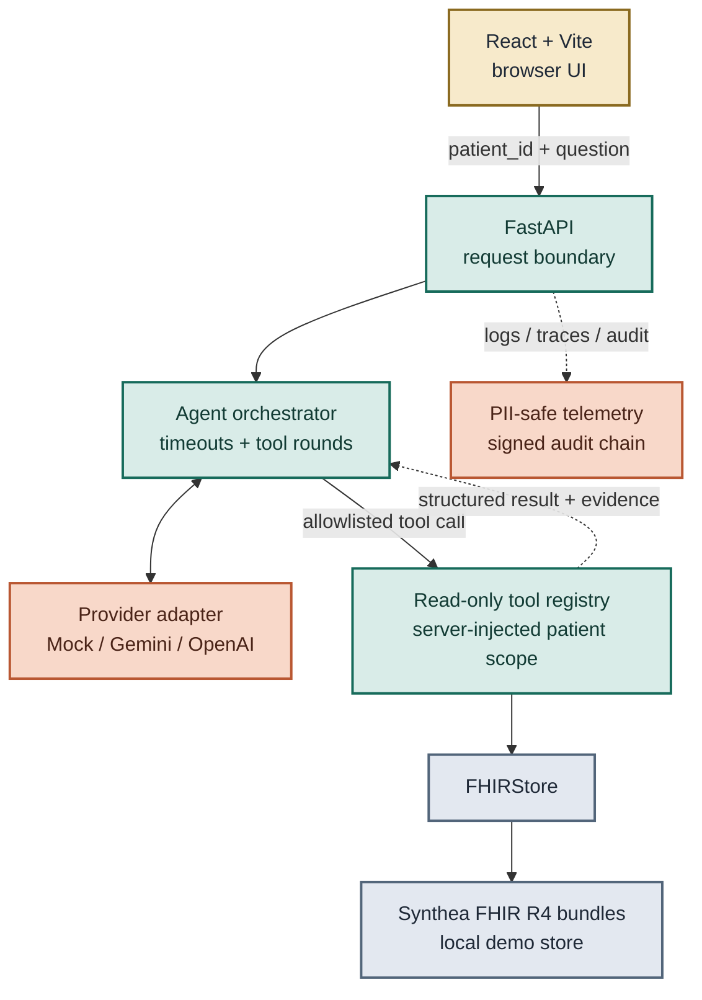

# FHIR Care Copilot README Distillation Implementation Plan

> **For agentic workers:** REQUIRED SUB-SKILL: Use superpowers:subagent-driven-development (recommended) or superpowers:executing-plans to implement this plan task-by-task. Steps use checkbox (`- [ ]`) syntax for tracking.

**Goal:** Replace the evidence-heavy README with a concise recruiter-first front page that keeps the project's verified security, synthetic-data, and non-clinical boundaries intact.

**Architecture:** This is a documentation-only change. The README becomes the short entry point; canonical model, data, security, and case-study documents retain the detailed evidence. A validated top-to-bottom Mermaid component diagram replaces the wide diagram.

**Tech Stack:** GitHub-flavored Markdown, Mermaid flowchart, existing pytest public-claim contracts, Vitest, Mermaid CLI.

## Global Constraints

- Modify no runtime, frontend, API, CI, Docker, dependency, evaluation, or deployment behavior.
- Keep the README between 140 and 170 lines where practical, with 180 lines as the hard ceiling.
- Keep at most seven prose/documentation links; badge targets do not count.
- Keep exactly one existing screenshot: `docs/screenshots/02-answer-with-evidence.png`.
- Use `API key` consistently and leave no Chinese credential term in the README.
- Keep Synthea synthetic-data and explicit non-clinical-use disclosures.
- Keep patient-scope enforcement distinct from caller authorization and tenant isolation.
- Keep HAPI FHIR described as an optional stub and reference integrity distinct from claim grounding.
- Use no real medical data, paid model call, GPU, new feature, tag, release, push, or co-author trailer.
- Author and commit only as `kuotunyu <61350295+kuotunyu@users.noreply.github.com>`.

## File map

- Modify: `README.md` — concise public project entry point and vertical architecture diagram.
- Modify: `docs/superpowers/specs/2026-08-04-readme-distillation-design.md` — correct the measured v0.2.1 line count and preserve the existing demo-video contract within the link budget.
- Create: `docs/superpowers/plans/2026-08-04-readme-distillation.md` — this execution plan.
- Temporary only, then remove: Mermaid source/render files used to validate the diagram before it enters `README.md`.

---

### Task 1: Validate the vertical architecture diagram

**Files:**
- Temporary: system temporary directory `readme-architecture.mmd`
- Temporary: system temporary directory `readme-architecture.svg`

**Interfaces:**
- Consumes: verified request flow and trust boundaries from the approved design.
- Produces: Mermaid source that can be copied unchanged into `README.md` after successful rendering.

- [ ] **Step 1: Write the candidate Mermaid source to a temporary file**

Use this exact component flow, keeping `flowchart TB` and every `classDef` text color:



- [ ] **Step 2: Render the candidate with Mermaid CLI**

Run Mermaid CLI against the temporary source and produce an SVG. Expected: exit code 0 and a non-empty SVG. If it fails, use the local Mermaid troubleshooting guide, make one syntax correction, and rerun before touching `README.md`.

- [ ] **Step 3: Inspect the rendered result once**

Confirm the primary path reads top to bottom, no node label is clipped, the two side branches remain secondary, and all text has sufficient contrast. Delete the temporary source and SVG after the same validated source has been placed in the README.

### Task 2: Rewrite the README to the approved recruiter-first structure

**Files:**
- Modify: `README.md`

**Interfaces:**
- Consumes: validated Mermaid from Task 1, the existing screenshot, and canonical committed evidence documents.
- Produces: one concise public README whose claims satisfy existing repository contracts.

- [ ] **Step 1: Replace the opening with positioning and three review paths**

Keep the CI and Release badges. State immediately that this is a security-focused FHIR AI application using Synthea synthetic data and is not a medical diagnosis or clinical-use product. Preserve these exact contract phrases:

```text
公開 demo 固定使用 `mock` provider
Synthea 合成資料
```

Expose only the live demo, existing 75-second demo video, and case study as the opening review links. The Release badge remains the latest-release entry point.

- [ ] **Step 2: Add the three-value summary and one screenshot**

Use exactly three bullets:

1. server-injected patient scope that the model cannot select or override;
2. read-only FHIR tools returning verifiable `resourceType/id` evidence;
3. PII-safe telemetry, signed audit history, deterministic mock mode, and CPU-safe reproducibility.

Embed only `docs/screenshots/02-answer-with-evidence.png` with a short synthetic-demo alt text. Do not add a screenshot heading, capture-script link, or generation-process explanation.

- [ ] **Step 3: Insert the validated vertical Mermaid and its truth statement**

Copy the Task 1 Mermaid source unchanged. Follow it with a short paragraph containing all three existing public-claim contract phrases:

```text
病患資料檢索只會經由 allowlisted deterministic tools
tool 結果包含 FHIR `resourceType/id` references
`reference existence` 不代表自然語言答案逐句 grounded
```

Also state that the model has no direct FHIR-store access and HAPI FHIR is only an optional adapter stub.

- [ ] **Step 4: Compress security boundaries into one table**

Use five rows: patient scope, read-only tools, evidence semantics, authentication/authorization, and privacy/observability. Explicitly state that API-key authentication is not user-to-patient authorization, RBAC, tenant isolation, or SMART-on-FHIR.

- [ ] **Step 5: Compress evidence and failure behavior**

Keep a short evidence list covering the current backend/frontend test evidence, provider evaluation artifacts, Docker health/smoke evidence, and GitHub CI/CodeQL/Dependabot status without claiming clinical or production readiness. Summarize failure behavior in one sentence: invalid credentials fail closed, unavailable audit storage degrades health and blocks chat, and provider failures return a structured refusal.

Link only `MODEL_CARD.md`, `DATA_CARD.md`, and `SECURITY.md` for deeper evidence and limits.

- [ ] **Step 6: Keep one minimal quick start and closeout**

Keep the existing Synthea subset command and `just run`, mention the automatic mock fallback when no provider API key is configured, and include `docker compose up --build` as the Docker alternative. Close with one compact technology line and Synthea/Apache-2.0 attribution linked only to `LICENSE`.

### Task 3: Verify the public artifact and commit it

**Files:**
- Verify: `README.md`
- Verify: `docs/superpowers/specs/2026-08-04-readme-distillation-design.md`
- Verify: `docs/superpowers/plans/2026-08-04-readme-distillation.md`

**Interfaces:**
- Consumes: completed documentation diff.
- Produces: one reviewable README commit with evidence of syntax, claims, tests, and identity.

- [ ] **Step 1: Run structural checks**

Confirm the README is no more than 180 lines; `flowchart TB` occurs once; exactly one standalone local image remains; no screenshot heading, capture-script reference, or Chinese credential term remains; all occurrences use `API key`; and the seven prose links are exactly the approved targets.

- [ ] **Step 2: Verify local link targets and public-claim contracts**

Run:

```text
uv run pytest tests/test_public_claims.py tests/test_release_metadata.py -q
```

Expected: all focused tests pass, including the required CI badge, Release badge, case study, v0.2.0 demo video, mock-demo boundary, Synthea disclosure, and reference-integrity semantics.

- [ ] **Step 3: Run full CPU-safe regression checks**

Run:

```text
uv run pytest
npm test --prefix app
```

Expected baseline: 535 backend tests pass with 9 environment-dependent skips; 38 frontend tests pass. Any changed count must be explained from the current collected suite before claiming success.

- [ ] **Step 4: Run final formatting and design checks**

Run `git diff --check`, validate that all relative README targets exist, and run the Impeccable detector once against `README.md`. Review the rendered Mermaid SVG and retained screenshot together in one bounded visual pass; make at most one correction batch and one confirmation pass.

- [ ] **Step 5: Commit as the repository owner only**

Stage only the README, approved design correction, and implementation plan. Commit as `kuotunyu <61350295+kuotunyu@users.noreply.github.com>` with no co-author trailer. Verify author, committer, branch, HEAD, and clean worktree. Do not push, tag, create a Release, or alter `main` without a separate instruction.
